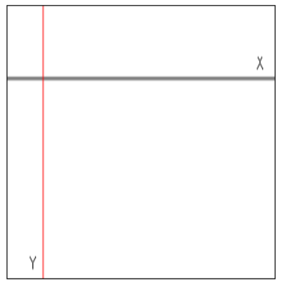

# Canvas #
  
## Canvas 元素的目的 ##
  
`Canvas` 是一个依赖于分辨率的位图画板，能被用于渲染图形、游戏画面和其他可视图像。在画板上画图依赖于 `2D API`。该 `API` 提供了很多用于在画板上画任何东西的函数。目前，`Canvas` 只支持 `2D` 尚不支持 `3D`。  
```Html
	<canvas id="myCanvas" style="width:300px; height:300px"></canvas>
```     
初始的画板是空的，看不到任何东西。一个网页上可以有多个 `Canvas` 元素。通过给每个 `Canvas` 元素非配不同的 `id` 属性，就可以通过 `JavaScript` 来个性化设置它们。  
为了要在 `Canvas` 上画画，需要取得当前 `Canvans` 的 `context` 的引用。`context` 提供了 *2D* 属性和方法去画和人操控`Canvas`元素上的图像。  
每个 `Canvas` 元素都有 `x, y` 坐标。`x` 为水平坐标， `y` 为垂直坐标。  
  
  
## 与 SVG 相比 ##
  
*SVG* 是基于 *XML* 的向量图格式。可以使用 *CSS* ，也可以通过 *SVG DOM* 来增加动态效果。  
*Canvas* 通过 *JavaScript* 来画图和形状。同样可以使用 *CSS* 和增加动态效果。  
  
**推荐使用 Canvas 的原因：**  
* 在画复杂图形时， *Canvas* 更快速。  
* 可以保存 *Canvas* 的图像。  
* 在 *Canvas* 中的任何东西都是像素。  

另一方面， *SVG* 的优势在于：  
* 它不依赖于分辨率，因此可以在不同的频率分辨率下等比例的变化。   
* 是 *XML* 的，  so targeting different elements is a breeze 。  
* 擅长于复杂的动画。  

## 2D API ##
  
*2D API* 是一个对象，可用于画图和操控图像。获得 *Canvas* 元素的 `context` 对象，需要调用 `getContext()` 方法，如下，  
```Javascript
	var myCanvas = document.getElementById("myCanvas");  
	var context = myCanvas.getContext("2d");
```  
每个 *Canvas* 都有自己独立的 `context`。  
  
**变换函数：**  
* `scale` 等比例缩放当前 `context`  
* `rotate` 旋转当前 `context` 的 `x, y` 轴  

**状态函数：**  
* `save` 保存 `context` 的当前状态  
* `restore` 从之前保存的状态恢复 `context` 状态  

**文本函数：**  
* `font` 取得或设置当前 `context` 的 `font`  
* `fillText` 在当前 `canvas` 渲染填充文本  
* `measureText` 测量指定文本的当前宽度    

## 形状和颜色 ##
  
**矩形：**  
* `fillRect(x, y, w, h)` 画出指定矩形，并用当前填充风格填充  
* `strokeRect(x, y, w, h)`   
其中， `x, y` 为中心坐标， `radius` 为半径， `startAngle, endAngle` 为起始角度,这里的**角度都是相对于正 x 轴顺时针的角度**， `anticlockwise` 为是否逆时针，取值为 `true, false` 。

**圆形：**  
* `arc(x, y, radius, startAngle, endAngle, anticlockwise)`   

```javascript
	context.beginPath();
	context.fillStyle = "rgba(0, 0, 0, 1.0");
	context.arc(123, 93, 70, 0, 2 * Math.PI, true);
	context.fill();
```  
用于画实心圆，填充色由 `fillStyle` 指定。  
  
```javascript
	context.beginPath();
	context.strokeStyle = "rgba(0, 0, 0, 1.0");
	context.arc(123, 93, 70, 0, 2 * Math.PI, true);
	context.stroke();
```    
这里，画的是圆的轮廓。  
  
**贝塞尔曲线：**  
* `bezierCurveTo(cp1x, cp1y, cp2x, cp2y, x, y)` 

```javascript
	context.lineWidth = 20;
	context.beginPath();
	context.moveTo(5, 50);
	context.bezierCurveTo(30, 30, 130, 530, 200, 100);
	context.stroke();  
```   
  
**线性渐变：**  
线性渐变可以通过 `createLinearGradient()`方法实现。通过`addColorStop`方法给渐变增加颜色，调用该方法时需要指出 `x, y` 轴坐标。如：  
```html5
	var gradient = context.createLinearGradient(0, 0,0, 145);
	gradient.addColorStop(0, "#00ABEB");
	gradient.addColorStop(0.5, "yellow");
	gradient.addColorStop(0.8, "green");
	gradient.addColorStop(1, "white");
	context.fillStyle = gradient;
	context.fillRect(5, 5, 145, 145);
```  
  
## 线条，文本，阴影 ##
   
**线条：**  
每个`canvas`有一条路径。定义一条路径就像画一条线一样。**先定义一条路径，然后填充路径。**下面是一些相关属性和函数用于画线条：  
* `lineWidth[=value]` 返回当前线宽。也能用于设置新的宽度值。  
* `lineCap[=value]` 返回当前线冒风格。也能用于设置新的风格。可选值为`butt, round, square`  
* `lineJoin=[value]` 返回当前**线连接风格**。也能用于设置新的连接风格。可选值为`bevel, round, miter`  

画线需要调用`moveTo, lineTo` 方法。方法接受两个参数 `x,y` 明确指出确定坐标。也能通过 `lineWidth` 指定线宽。一旦定义了线条，需要调用 `stroke` 去画线。  
  
**文本：**  
与网页上的文本不同，这里没有**盒模型，**也就意味这*CSS样式*不能使用。相关属性和方法：  
* `font[=value]` 返回当前字体设置。也能用于设置新的字体。语法与*CSS*字体属性相同。  
* `textAlign[=value]` 返回当前文本对齐设置。也能用于设置新的对齐方式。可选值为`start, end, left, right, center`  
* `textBaseline[=value]` 返回当前基线对齐设置。也用于设置新的基线对齐  
* `fillText(text, x, y [,maxWidth])` 在指定位置填充文本  
* `strokeText(text, x, y[,maxWidth])` 在指定位置画文本  
* 