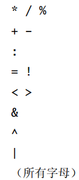

# 基本类型和操作 #
  
## 基本类型 ##
  
整数型： `Byte, Short, Int, Long, Char` 加上 `Float, Double` 被称作为 **数类型: numeric type** 。 
* Byte --- 8 位有符号补码整数  
* Short --- 16 位有符号补码整数  
* Int --- 32 位有符号补码整数  
* Long --- 64 位 有符号补码整数  
* Char --- 16 位无符号 Unicode 字符  
* String --- 字符序列  
* Float --- 32 位 IEEE754 单精度浮点数  
* Double --- 64 位 IEEE754 单精度浮点数  
* Boolean --- true 或 false 	  

除了 *String* 归于 `java.lang` 包以外，其余所有的基本类型都是包 `scala` 的成员。  
  
## 文本 ##
  
文本是直接在代码里写常量值的一种方式。  

* 如果数字以 `0x, 0X` 开始，则是十六进制，只能包含 `0 - 9， A - F` 。  
* 如果数字以 `0` 开始，则是八进制，并且只能包含数字 `0-7` 。  
* 如果数字以非零数字开始，并且没有被修饰过，就是十进制。  
* 如果整数文本结束与 `l, L` ，就是 `Long` 类型，否则就是 `Int` 类型。  
* 如果 `Int` 类型的文本被赋值给 `Short` 或者 `Byte` 类型的变量，文本就会被看做是能让文本值在那个类型有效范围内那么长的 `Short` 或者 `Byte` 类型。  

## 浮点数文本 ##
  
浮点数文本是由十进制数字，可选的小数点和可选的 `E， e` 及指数部分组成。指数部分表示的是以 10 为底的幂次数。  
如果浮点数文本以 `F, f`结尾就是 `Float` 类型，否则就是 `Double` 类型。  
  
## 字符文本 ##
  
字符文本可以是在 **单引号** 之间的任何 *Unicode* 字符。除了在单引号之间显示地提供字符之外，还可以提供一个表示字符代码点的前缀反斜杠的八进制或十六禁止数字。  
  
## 字串文本 ##
  
字串文本由 **双引号** 环绕的字符组成。  
由于字符串中可能会包含很多的转义序列，因此 *Scala* 引入了 **原始字串: raw string** 的特殊语法。以同一行里的三个引号 **"""** 开始和结束一条原始字串。内部的原始字串可以包含无论何种任意字符，包括新行、引号、特殊字符，当然同一行的三个引号除外。  
  
## 操作符和方法 ##
  
**可以把任何方法当作操作符来标注。**  
例如：  
```Scala
	val s = "Hello, World"
	val index1 = s.indexOf('o')
	val index2 = s indexOf 'o'     // 上一个等效
```  
  
当以操作符标注的方式调用多个参数的方式时，这些参数必须放在括号内。  
  
可以当作前缀操作符的标识符只有 `+ - ! ~` 。  
后缀操作符是不用点或括号调用的不带任何参数的方法。  
在 *Scala* 里，可以舍弃方法调用的空括号。例外就是如果方法带副作用就要加上括号，如果方法没有副作用就可以去掉空括号。  
<center>

</center>  
  
操作符的 **关联性: associativity** 决定了操作符分组的方式。 *Scala* 里操作符的关联性取决于它的最后一个字符。  
任何以 `：` 结尾的方法由它的右侧操作数调用，并传入左操作数。以其他字符结尾的方法，都是被左操作数调用，并传入右操作数。  
  
**不论操作符具有什么关联性，，它的操作数都是从左到右被计算的。**
  
## 富包装器 ##
  
基本类型  --->  富包装  
* Byte --- scala.runtime.RichByte  
* Short --- scala.runtime.RichShort  
* Int --- scala.runtime.RichInt  
* Long --- scala.runtime.RichLong  
* Char --- scala.runtime.RichChar  
* String --- scala.runtime.RichString  
* Float --- scala.runtime.RichFloat  
* Double --- scala.runtime.RichDouble  
* Boolean --- scala.runtime.RichBoolean