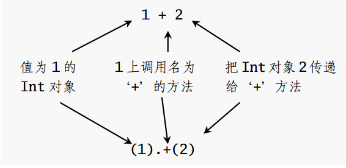
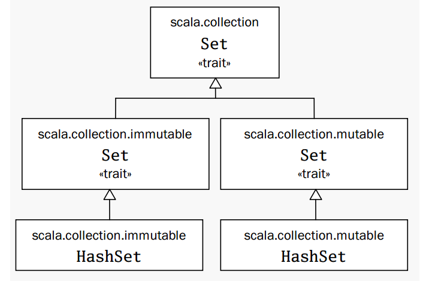
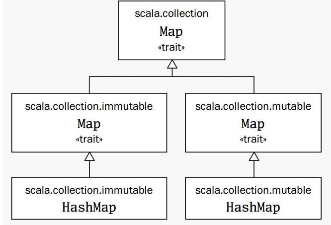

# 基础 #
  
1. 函数文本的语法是，括号里的命名参数列表， 右箭头，然后是函数体。  
<center>

</center>  
2. `Scala` 中指令式 `for expression`  
```Scala
	for(arg <- args)
		println(arg)
```
在表达式里 `for` 之后的括号里包含 `arg <- args` 。 `<-` 右侧是熟悉的 `args` 数组， `<-` 左侧是 `arg`, 类型为 `val` 。尽管 `arg` 感觉上像是 `var`， 因为每次枚举都会得到新的值，但它确实是 `val` 。 **arg 在 for 表达式的函数体中不能重新赋值。** 取而代之，对每个 `args` 数组的元素，一个新的 `arg val` 将被创建并初始化为元素值，然后 `for` 的函数体将被执行。  
  
## 带类型的参数化数组 ##
  
`Scala` 里可以使用 `new` 实例化对象或类实例。当在 `Scala` 里实例化对象，可以使用值和类型把它 **参数化 parametrize** 。  
> 参数化的意思是在创建实例的时候 “设置” 它。通过把加在括号里的对象传递给实例的构造器的方式用值参数实例化。    

例如： `val big =  new java.math.BigInteger("12345")` ,通过在括号里设置一个或更多类型来 **参数实例化。**    
  
注意：当同时用类型和值去参数化实例的时候，类型首先在方括号中出现，然后跟着值在圆括号中。   
```Scala
	val greetStrings = new Array[String](3)  

	val greetStrings : Array[String] = new Array[String](3)  //等效
```  
上面说明：类型参数化部分(也就是方括号里的类型名) 形成了实例类型的部分，也就是表示 `new` 的对象与该类型参数有关。而值参数化部分(圆括号里的值) 不是。 **greetStrings 是类型是 Array[String], 不是 Array[String](3) 。**  
  
> Scala 里面的数组是通过把索引值放在圆括号里面访问的，而不是像 Java 那样放在方括号中。  

当用 `val` 定义一个变量，那么 **这个变量就不能重新赋值，但它指向的对象仍可以暗自改变。**  
  
如果方法仅带一个参数，就可以不带点或括号去调用。例如：  `0 to 2 等价于 (0).to(2)` 。这个语法仅在显示指定方法调用的接受者时才起作用。也就是说， `0 to 2` 里面的 `0` 不能省略。  
从技术上讲， *Scala* 没有操作符重载，因为它根本没有传统意义上的操作符，取而代之的是，诸如 `+ - * /` 这样的字符用来做 **方法名。**  
<center>

</center>  
  
当你在一个或多个值或变量外使用括号时， *Scala* **会把它转换成对名为 apply 方法的调用。** 于是， `greetStrings(i)` 转换成 `greetStrings.apply(i)` ，所以 *Scala* 里访问数组的元素只不过是根其他的一样的方法调用。这个原则不仅仅局限于数组： **任何对某些在括号中的参数的对象的应用都将被转换为对 apply 方法的调用。** 当然，前提是这个类型实际定义过 `apply` 方法。  
类似的，当对带有括号并包括一到若干参数的变量赋值时，编译器将把它转化为对带有括号里参数和等号右边的对象的 `update` 方法的调用。例如：  
```Scala 
	greetStrings(0) = "Hello"  
	将被转化为  
	greetStrings.update(0, "Hello")
```  
  
创造和初始化数组：  
```Scala
	val numNames = Array("zero", "one", "two")

	val numNames2 = Array.apply("zero", "one", "two")  //等效
```  
上面，编译器会推断数组的类型是 `Array[String]` 。实际上，上面就是调用一个叫做 `apply` 的工厂方法，从而创造并返回了新的数组。 `apply` 方法带可变数量个参数，被定义在 *Array* 的 **伴生对象 companion object** 上。  
  
## 使用 List ##
  
方法不应该有副作用是函数风格编程的一个很重要的理念。 **方法的唯一效果应该是计算并返回值。**  
*Scala* 数组是一个所有对象都共享相同类型可变序列。 数组实例化之后无法改变长度，但是元素值却是可以改变的。因此， **Array 是可变的对象。**   
```Scala
	// 创造和初始化列表
	val oneTwoThree = List(1, 2, 3)
```    
因为 *List* 是不可变的，当在 *list* 上调用方法时，似乎这个名字指代的 *List* 看上去被改变了，而实际上它只是用新的值创建了一个 *List* 并返回。 比如，*List* 中的 `:::` 的方法实现叠加功能。  
```Scala  
	val oneTwo = List(1, 2)
	val threeFour = List(3, 4)
	val oneToFour = oneTwo ::: threeFour
```  
另一个操作， *cons* `::` 把一个新元素组合到已有 *List* 的最前端，然后返回结果 *List* 。  
```Scala
	val twoThree =List(2, 3)
	val oneTwoThree = 1 :: twoThree
```
  
注意： `1 :: twoThree` 中， `::` 是右操作数 `twoThree` 的方法。  
  
**规则：如果一个方法被用作操作符标注，如 a * b， 那么方法被左操作数调用，就像 a.(b) --- 除非方法名以冒号结尾。**  当方法名以冒号结尾时，方法被 **右操作数** 调用。  
定义空类的捷径是 `Nil` ， 所以一种新的初始化 *List* 的方法是把所有元素用 *cons* 操作符串起来， `Nil` 作为最后一个元素。  
```Scala  
	val oneTwoThree = 1 :: 2 :: 3 :: Nil
```  
  
*List* 的一些方法和作用：  
* `List(), Nil` --- 表示空 *List*  
* `List("cool", "tools", "rule")` --- 创建带有三个值的新 *List[String]*  
* `val thrill = "Will" :: "fill" :: "until" :: Nil` --- 创建带有三个值的新的 *List[String]*  
* `List("a","b") ::: List("c", "d")` --- 叠加两个列表，并返回新的 *List[String]*  
* `thrill(2)` --- 返回在 *thrill* 列表上索引为 2 的元素，索引值从 0 开始  
* `thrill.count(s => s.length == 4)` --- 计算长度为 4 的元素的个数  
* `thrill,drop(2)` --- 返回去掉前 2 个元素的 `thrill` 列表  
* `thrill,dropRight(2)` --- 返回去掉后 2 个元素的 `thrill` 列表  
* `thrill.exists(s => s =="until")` --- 判断是否有值为 `until` 的字符串在 `thrill` 列表里，返回 `true， false`  
* `thrill.filters(s => s.length == 4)` --- 依次返回所有长度为 4 的元素组成的列表  
* `thrill.forall(s => s.endsWith("l")` --- 判断是否 `thrill` 列表里所有元素都以 *l* 结尾， 返回 `true, false`  
* `thrill.foreach(s => println(s))` --- 对 `thrill` 列表中每个子串执行 `print` 语句  
* `thrill.foreach(print)` --- 同上，更简洁  
* `thrill.head` --- 返回 `thrill` 列表的第一个元素  
* `thrill.init` --- 返回 `thrill` 列表除最后一个元素以外的其他元素组成的列表  
* `thrill.isEmpty` --- 说明 `thrill` 列表是否为空，返回 `true, false`   
* `thrill.last` --- 返回 `thrill` 列表的最后一个元素   
* `thrill.length` --- 返回 `thrill` 列表的元素数量  
* `thrill.map(s + s + "y")` --- 返回一个 `List` 列表其中每个元素都是 `thrill` 列表中元素加上 `y` 组成。  
* `thrill.mkString(", ")` --- 用列表的元素创建字串，返回 `"will, fill, until"`   
* `thrill.remove(s => s.length == 4)` --- 返回除去 `thrill` 列表中长度为 4 的元素后依次排列的元素列表   
* `thrill.reverse` --- 返回含有 `thrill` 列表的逆序元素的列表  
* `thrill.sort((s,t) => s.charAt(0).toLowerCase < t.charAt(0).toLowerCase)` 返回包括 `thrill` 列表所有元素，并且第一个字符小写按照字母顺序排列的列表  
* `thrill.tail` --- 返回除掉第一个元素的 `thrill` 列表   

**待确认： `thrill.reverse` --- 返回含有 `thrill` 列表的逆序元素的列表 ？**  
  
## 使用 Tuple ##
  
另一种有用的容器对象是 **元祖  tuple** 。与列表一样，元祖也是不可变的，但与列表不同的， **元素可以包含不同类型的元素。**  
实例化一个装有一些对象的新元祖，只要把这些对象放在括号里，并且逗号分割开即可。一旦已经实例化了一个元祖，你可以用点号，下划线和一个基于 1 的元素索引访问它。  
```Scala  
	val pair = ( 99, "Buftballons")   //创建元祖
	println(paior._1)                 //打印第一个元素
	println(pair._2)                  //打印第二个元素
```  
  
元祖的实际了诶性取决于它包含的元素数量和这些元素的类型。  
**元祖只支持到 Tupe22, 即 22 个元素。**  
  
## 使用 Set 和 Map ##
  
*Scala* 为了充分利用函数式和指令式风格两方面的好处，它的集合类型库于是就区分了集合类的可变和不可变。  
*Scala* 的 *API* 包含了集的一个基本 **特质 trait** ， 特质的概念接近于 *Java* 的接口。*Scala*提供了能给个了两个子特质， **一个是可变的集，一个是不可变的集。**   
```Scala
	//创建、初始化 集
	var jetSet = Set("Boeing", "Airbus")
	jetSet += "Lear"
	println(jetset.contains("Cessna")
```  
创建集的防御与创建列表和数组的类似：通过调用 `Set` 伴生对象的名为 `apply` 的工厂方法。  
<center>

</center>  

要向集中加入新的变量，可以在集上调用 `+` ，传入新的元素。可变的和不可变的集都提供了 `+` 方法，但是它们的行为不同。 **可变集将把元素加入自身，不可变集集将创建并返回一个包含了添加元素的新集。**  
如果需要可变集，就需要使用一个 **引用：import** ：  
```Scala
	// 创建、初始化，使用 可变集
	import scala.collection.mutable.Set
	val movieSet = Set("Hitch", "Poltergeist")
	movieSet += "Shrek"
	println(movieSet)
```  
这样，当使用 `Set` 时，编译器就知道所指的是 `scala.collection.mutable.Set` 。  
  
*Map* 是 *Scala* 里的另一种有用的集合类。和集一样， *Scala* 采用了类继承机制提供了可变的和不可变的两种版本 *Map* 。  
```Scala
	import scala.collection.mutable.Map
	val treasureMap = Map【Int, String]()
	treasureMap += (1 -> "Go to island.")
	treasureMap += (2 -> "Find big X on ground.")
	treasureMap += (3 -> "Dig.")
	println(treasureMap(2))
```
<center>

</center>  
  
**使用 val 变量与可变集或可变映射配合使用， 使用 var 变量与不可变集或不可变映射配合。**    
` -> ` 方法可以调用 *Scala* 程序里的任何对象，并返回一个包含键和值的二元元祖。  
  
## 学习识别函数式风格 ##
   
通向函数式风格路上的第一步是识别这两种风格在代码上的差异。其中的一点蛛丝马迹就是，如果代码包含了任何 *var* 变量，那么它大概就是指令式的风格。如果代码仅仅包含 *val* ，那么大概就是函数式风格。 因此，向函数式风格推进的一个方式，就是尝试不用任何 *var* 编程。  
  
```Scala
	// 使用 var 
	def printArgs(args : Array[String] : Unit = {
		var i = 0
		while (i < args.length) {
			println(args(i)
			i += 1
		}
	}   
```  
  
通过去掉 *var* 的办法把这个代码变得更函数式风格：  
  
```Scala
	def printArgs(args : Array[String]) : Unit = {
		for ( arg <- args)
			println(arg)
	}  
  
	def printArgs(args : Array[String]) : Unit = {
		args.foreach(println)
	}
```  
  
函数有副作用的马脚就是结果类型为 `Unit` 。如果某个函数不返回任何有用的值，就是说其结果类型为 `Unit` ，那么哪个函数唯一能让世界有点儿变化的方法就是通过某种副作用。  
  
```Scala
	// 更函数式的方法
	def formatArgs(args : Array[String]) = args.mkString("\n")
```  
上面的函数返回一个字符串。  
  
## 从文件里读取信息行 ##
  
处理琐碎的，每日工作的脚本经常要处理文件。  
从建立一个从文件中读行记录，并把行中字符个数前置到每一行，打印输出的脚本。  
```Scala
	// 从文件中读取行
	import scala.io.Source

	if (args.length > 0) {
		for (line <- Source.fromFile(args(0)).getLines)
			println(line.length + " " + line)
		}
	else {
		Console.err.println("Please enter filename")
	}
```  
  
`getLines` 方法返回的是枚举器。一旦使用它完成了遍历，枚举器就会失效。而通过 `toList` 把它转换为 *List*，就可以枚举任意次数， 代价就是文件中的所有航一次性储存在内存里。
